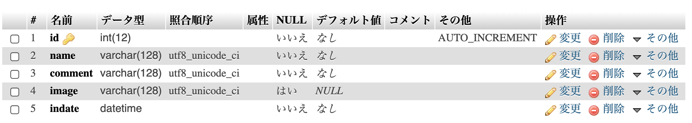

# $.ajax()を使ってファイル諸共にPHPにデータを送信してdbに保存してみるサンプルを実装する

作成日：2019/11/05

## 目的
- ファイル送信がややこしいので復習する．
- どうせならjsからファイル送信したい．
- 1回作っとけばなんとかなるやろ．

## 仕様
- 某チャンネル掲示板風．
- 名前とコメントと画像を入力して送信する．
- 送信するとdbに保存された一覧が表示される．
- showNewボタンをクリックすると最新の状態に更新される．
- 名前と画像の入力は任意．

## 準備
- ajax_tableを作成．
- 構成は以下．

- `functions.php`のdb名を変更．

## 実装
- フロントとサーバで分ける．
- フロントは`index.html`に記述．
- サーバはデータ取得用の`ajax_get.php`とデータ登録用の`ajax_post.php`の2ファイル．

### 処理の流れ
流れは以下の通り
【データ取得編】
- `index.html`読み込み時にdbからデータを取得する`ajax_get.php`へリクエストを送る関数（`getAllDataFromDb()`）を実行．
- `ajax_get.php`では，リクエストが来たらテーブルから全部データ取得してjsonを返す．
- データが戻ってきたら，取得したデータをいい感じにタグに入れる関数（`createListTagFromData()`）に渡し，画面に表示する．

【データ送信編】
- `index.html`の送信ボタンクリックでフォームのデータを取得する．
- 取得したデータを`ajax_post.php`に送信する関数（`insertDataToDb()`）を実行．
- `ajax_post.php`では送信されたデータを受け取り，必要なチェックを行う．
- ファイルの送信有無によって処理を分岐させ，画像ありversionとなしversionで別々のsqlを記述する．
- ファイル関連の処理が終わったら，記述されたsqlを実行し，データをテーブルに保存する．
- 保存終了後，すべてのデータをテーブルから取得し，jsonにして返す．
- `index.html`にデータが戻ってきたら，取得したデータをいい感じにタグに入れる関数に渡し，画面の表示内容を更新する．

### フロント

dbからデータを取得するために`ajax_get.php`へリクエストを送る関数

```javascript
// getAllDataFromDb()
// DBからデータを取得する関数
const getAllDataFromDb = () => {
  const url = 'ajax_get.php';
  $.ajax({
    method: 'GET',
    url: url,
    dataType: 'json',
  }).done(function (data) {
    console.log(data);
    // タグに入れる関数にデータを投げ，指定したidの部分に表示する
    $('#echo').html(createListTagFromData(data));
  }).fail(function (error) {
    console.log(error);
  }).always(function () {
    console.log('completed!');
  });
};
```

データをいい感じにタグに入れる関数（`getAllDataFromDb()`より上に書く）

```javascript
// createListTagFromData()
// データをいい感じのタグに入れる関数
function createListTagFromData(data) {
  // 出力用の配列を用意
  const array = [];
  // 順番にタグの形にして出力用の配列に追加する
  for (let i = 0; i < data.length; i++) {
    const str =
      `<li class="list-group-item">
        <p>${data[i].id} ${data[i].name} ${data[i].indate}</p>
        <p>${data[i].comment}</p>
        
      </li>`
    array.push(str);
  }
  // 全部追加したらjoin()を使って，配列を連続した文字列にする
  return array.join('');
};
```

データをいい感じにタグに入れる関数

```javascript
// insertDataToDb()
// PHPへデータを送信する関数
function insertDataToDb() {
  const url = 'ajax_post.php';
  // ファイル諸共にフォームの中身を取得する
  const data = new FormData($('#insert_form').get(0));
  // ajaxでデータを投げる
  $.ajax({
    method: 'POST',
    url: url,
    data: data,
    dataType: 'json',
    // ↓この2つはファイルを送信する場合に必須
    processData: false,
    contentType: false,
  }).done(function (data) {
    console.log(data);
    // タグに入れる関数にデータを投げ，指定したidの部分に表示する
    $('#echo').html(createListTagFromData(data));
    // ボタンの無効化を解除する
    $('button').attr('disabled', false);
  }).fail(function () {
    console.log(error);
  }).always(function () {
    console.log('completed!');
  });
};
```

その他の処理
```javascript
// 読み込み時にデータを取得する関数を実行
getAllDataFromDb();

// ボタン押したら最新データ取得
$('#showNew').on('click', function () {
  getAllDataFromDb();
})

// 送信ボタンクリック時の処理
$('#send').on('click', function () {
  // 2重送信をしないためにボタンを無効化する
  $('button').attr('disabled', true);
  // データを送信する関数を実行
  insertDataToDb();
  // 入力欄を空にする処理
  $('#name').val('');
  $('#comment').val('');
  $('#upfile').val('');
})
```

※サーバも実装しないと動かないので注意！！！

### サーバ

#### データ取得側（`ajax_get.php`）の処理

```php
// 関数のファイル読み込み
include('functions.php');

// DB接続
$pdo = connectToDb();

// データ表示SQL作成（テーブルから全件読み込み）
$sql = 'SELECT * FROM ajax_table';
$stmt = $pdo->prepare($sql);
$status = $stmt->execute();

// データ表示
if ($status == false) {
  errorMsg($stmt);
} else {
  // fetchAll()で全部取れる
  echo json_encode($stmt->fetchAll());
}
```

#### データ登録側（`ajax_post.php`）の処理

入力チェックとか．

```php
// 関数のファイルを読み込み
include('functions.php');

// 入力チェック，コメントは入力必須
if (!isset($_POST['comment']) || $_POST['comment'] == '') {
  exit('ParamError');
} else {
  $comment = $_POST['comment'];
}

// POSTデータ取得，名前は入力なしの場合「名無しさん」にする
if (!isset($_POST['name']) || $_POST['name'] == '') {
  $name = '名無しさん';
} else {
  $name = $_POST['name'];
}
```

ファイルアップロードとファイル有無の条件分岐の処理．

```php
// Fileアップロードチェック
// エラーが発生していないか条件分岐
if (isset($_FILES['upfile']) && $_FILES['upfile']['error'] == 0) {
  // ファイルをアップロードしたときの処理
  // アップロードしたファイルの情報取得
  $file_name = $_FILES['upfile']['name'];
  $tmp_path  = $_FILES['upfile']['tmp_name'];
  $file_dir_path = 'upload/';

  // File名の変更
  $extension = pathinfo($file_name, PATHINFO_EXTENSION);
  $uniq_name = date('YmdHis') . md5(session_id()) . "." . $extension;
  $file_name = $file_dir_path . $uniq_name;

  // FileUpload開始
  if (is_uploaded_file($tmp_path)) {
    if (move_uploaded_file($tmp_path, $file_name)) {
      chmod($file_name, 0644);
      // アップロードしたファイルの情報含めてdbへの登録SQL作成
      $sql = 'INSERT INTO ajax_table(id, name, comment, image, indate) VALUES(NULL, :a1, :a2, :image, sysdate())';
    } else {
      exit('Error:アップロードできませんでした．');
    }
  }
  // FileUpload終了
} else {
  // ファイルをアップしていないときはimageカラムにnullを入れる
  $sql = 'INSERT INTO ajax_table(id, name, comment, image, indate) VALUES(NULL, :a1, :a2, null, sysdate())';
}
```

データ登録の処理．
```php
// db接続する関数を実行
$pdo = connectToDb();

// dbへの登録SQL実行
$stmt = $pdo->prepare($sql);
$stmt->bindValue(':a1', $name, PDO::PARAM_STR);
$stmt->bindValue(':a2', $comment, PDO::PARAM_STR);
// ファイルアップロードしているときのみ，:imageにファイルパスを設定する
if (isset($_FILES['upfile']) && $_FILES['upfile']['error'] == 0) {
  $stmt->bindValue(':image', $file_name, PDO::PARAM_STR);
}
$status = $stmt->execute();
```

登録後に最新データを取得する処理．
```php
// 登録後にデータ取得
$sql = 'SELECT * FROM ajax_table';
$stmt = $pdo->prepare($sql);
$status = $stmt->execute();

// データをjsonにして渡す
$view = '';
if ($status == false) {
  showSqlErrorMsg($stmt);
} else {
  echo json_encode($stmt->fetchAll());
}
```

## デバッグ

- エラーが出る場合は検証ツールのnetworkタブでファイルを選択し，previewなどを確認するとphpの実行結果が確認できる．